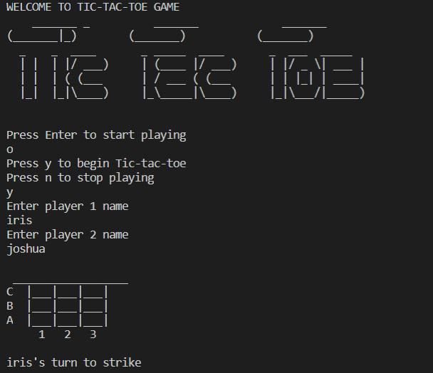

## Tic Tac Toe Game

This project is part of the Microverse Ruby Curriculum
Tic Tac Toe is a game in which two players alternately put Xs and Os in compartments of a figure formed by two vertical lines crossing two horizontal lines and each tries to get a row of three Xs or three Os before the opponent does.

## How to start the game

- Open the Command line Terminal
- Clone the project by running [git clone https://github.com/wintan1418/Tic-tac-toe.git] command
- Run ruby main.rb to start playing the game

## Rules for playing the game

- The game is played on a grid that's 3 squares by 3 squares.
- You are X, your friend is O. Players take turns putting their marks in empty squares.
- The first player to get 3 of her/his marks in a row (up, down, across, or diagonally) is the winner.
- When all 9 squares are full, the game is over. If no player has 3 marks in a row, the game ends in a tie.

## How to play the game

- The letters A,B,C and numbers 1,2,3 stand for positions of the squares of the game
- While playing, you have to choose the position by writing a1,a2,a3 or b1,b2,b3 or c1,c2,c3.

## Built with

- Ruby

## Author

👤 **Iris Enaelle Kineza**

- GitHub: [@KinezaEnaelle](https://github.com/KinezaEnaelle)
- Twitter: [@IKineza](https://twitter.com/IKineza)
- LinkedIn: [Iris Enaelle Kineza](https://www.linkedin.com/in/iris-enaelle-kineza-25a676187/)

 👤 **Oluwadare Juwon**

- GitHub: [@wintan1418](https://github.com/wintan1418)
- Twitter: [@juwonoluwadare](https://twitter.com/oluwadarejuwon)
- LinkedIn: [Oluwadare Juwon](https://www.linkedin.com/in/oluwadare-juwon-048a391a8/)

## 🤝 Contributing

Contributions, issues, and feature requests are welcome!

Feel free to check the [issues page](https://github.com/wintan1418/Tic-tac-toe/issues).

## Show your support

Give a ⭐️ if you like this project!

## License

This project is [MIT](https://github.com/KinezaEnaelle/Mint-Signup/blob/master/LICENSE) licensed.
